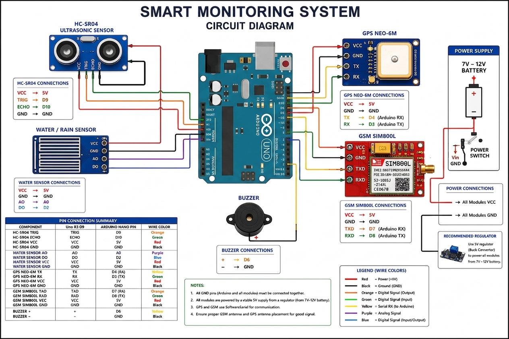

# 🚶 Smart Monitoring System

> Arduino UNO based monitoring system featuring obstacle detection, water sensing, GPS tracking, GSM communication, and buzzer alerts.

---

## 📷 Circuit Diagram



---

## 📖 Overview

The Smart Monitoring System is designed to enhance safety by combining multiple sensors and communication modules into a single platform.

The system can:

- Detect nearby obstacles using an ultrasonic sensor
- Detect water or rain presence
- Obtain real-time GPS coordinates
- Send SMS alerts through GSM communication
- Generate audio alerts using a buzzer

---

## ✨ Features

- 📡 GPS Location Tracking
- 📲 GSM SMS Alert System
- 🚧 Obstacle Detection
- 🌧 Water/Rain Detection
- 🔊 Audible Warning Alerts
- 🔋 Portable Battery Powered
- 🛠 Easy to Build and Expand

---

## 🧰 Components Used

| Component | Quantity |
|-----------|----------|
| Arduino UNO | 1 |
| HC-SR04 Ultrasonic Sensor | 1 |
| Water/Rain Sensor | 1 |
| GPS NEO-6M Module | 1 |
| SIM800L GSM Module | 1 |
| Buzzer | 1 |
| 7V–12V Battery | 1 |
| Buck Converter (5V Regulator) | 1 |
| Jumper Wires | As Required |

---

## 🔌 Pin Connections

### HC-SR04 Ultrasonic Sensor

| Sensor Pin | Arduino Pin |
|------------|------------|
| VCC | 5V |
| GND | GND |
| TRIG | D9 |
| ECHO | D10 |

### Water Sensor

| Sensor Pin | Arduino Pin |
|------------|------------|
| VCC | 5V |
| GND | GND |
| AO | A0 |
| DO | D2 |

### GPS NEO-6M

| GPS Pin | Arduino Pin |
|----------|------------|
| VCC | 5V |
| GND | GND |
| TX | D4 (RX) |
| RX | D3 (TX) |

### GSM SIM800L

| GSM Pin | Arduino Pin |
|----------|------------|
| VCC | 5V |
| GND | GND |
| TXD | D7 (RX) |
| RXD | D8 (TX) |

### Buzzer

| Buzzer Pin | Arduino Pin |
|------------|------------|
| + | D6 |
| - | GND |

---

## ⚙️ Working

### 1. Obstacle Detection
The HC-SR04 ultrasonic sensor continuously measures distance to nearby objects. When an obstacle is detected within a specified range, the buzzer is activated.

### 2. Water Detection
The water sensor monitors the presence of water or rain. When moisture is detected, the system triggers an alert.

### 3. GPS Tracking
The NEO-6M GPS module retrieves latitude and longitude coordinates from satellites.

### 4. GSM Communication
The SIM800L module sends SMS notifications containing alert information and location data.

### 5. Audio Alerts
The buzzer provides immediate warning notifications to the user.

---

## 🔋 Power Supply

### Recommended Configuration

- Battery Input: **7V – 12V**
- Regulated Output: **5V**
- Buck Converter Required

> ⚠️ SIM800L requires a stable power supply and can draw high current during network transmission.

---

## 📂 Project Structure

```text
Smart-Monitoring-System/
│
├── README.md
├── Smart-Blind-Stick-Circuit-System.png
├── smart_monitoring_system.ino
│
└── docs/
    └── Circuit_Diagram.pdf
```

---

## 🚀 Future Enhancements

- Mobile App Integration
- Emergency SOS Feature
- Voice Assistance
- IoT Cloud Connectivity
- Live Google Maps Tracking
- Rechargeable Battery System

---

## 💻 Software Requirements

- Arduino IDE
- TinyGPS++ Library
- SoftwareSerial Library

---

## Quick Links:
- [🔨 Build Guide](Guide-To-Build.md)
- [💻 Source Code](Code.cpp)


### ⭐ Star this repository if you found it useful!
