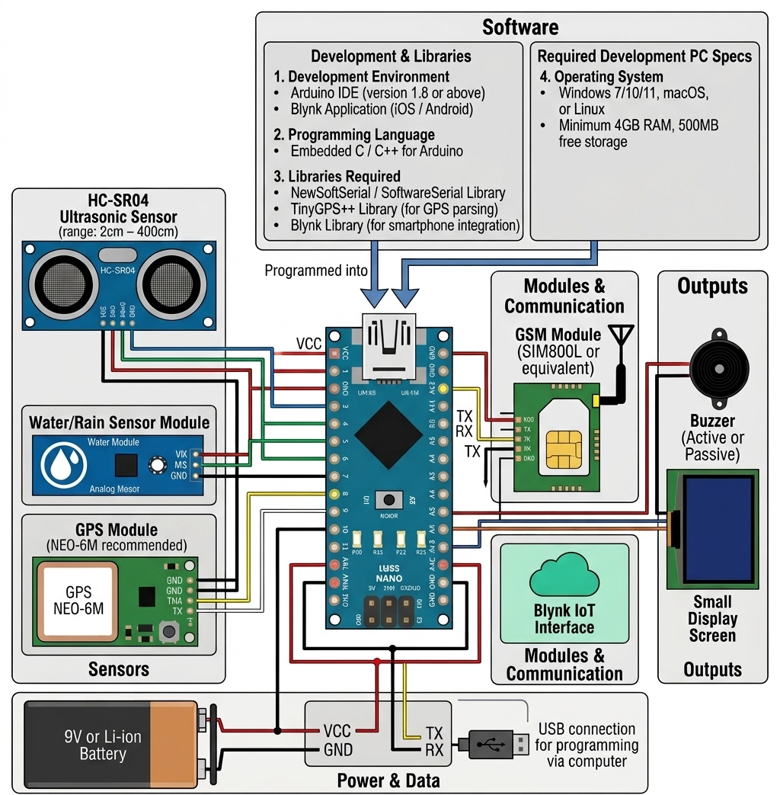

🦯 Smart Blind Stick

📌 Overview:
The Smart Blind Stick is an assistive device designed to help visually impaired individuals navigate safely. It detects obstacles using sensors and provides real-time alerts through sound or vibration, improving mobility and independence.

🚀 Features:
-Obstacle detection using ultrasonic sensor
-Real-time alerts via buzzer/vibration motor
-Easy to use and portable design
-Low-cost and efficient system
-Optional GPS tracking for location
-Optional GSM module for emergency alerts

🛠️ Components Used
-Arduino Nano/ ESP32
-Ultrasonic Sensor (HC-SR04)
-Buzzer
-Vibration Motor
-GPS Module (optional)
-GSM Module (optional)
-Battery & Connecting Wires

⚙️ How It Works
-The Ultrasonic sensor continuously measures the distance to new=arby objects. When an obstacle is detected within a predefined range, the microcontroller processes the data and triggers a buzzer or vibration motor to alert the user.

▶️ Usage
-Power on the device
-Hold the stick while walking
-Receive alerts when obstacles are nearby

📌 Future Improvements
-Add voice feedback system
-Integrate mobile app support
-Improve battery efficiency
-Add AI-based object detection

🤝 Contributing
-Contributions are welcome! Feel free to fork the repo and submit a pull request.

Circuit Diagram/image:

***🛠️ How to Build***
Follow the complete guide here:  
👉 [Steps to Build the Smart Blind Stick](Guide-to-build.md)

👉 [Code](Code.cpp)
